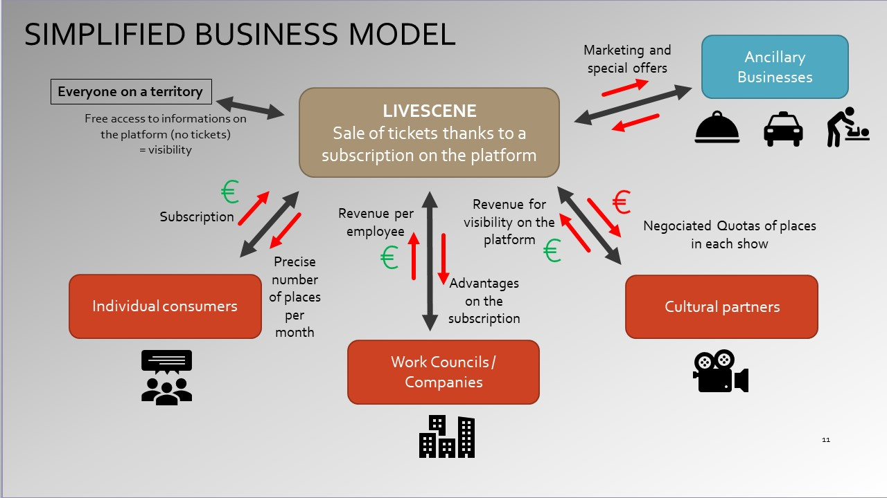

```{r setup, echo=FALSE, cache=FALSE}
library(knitr)
library(rmdformats)

## Global options
options(max.print="75")
opts_chunk$set(echo=FALSE,
	             cache=TRUE,
               prompt=FALSE,
               tidy=TRUE,
               comment=NA,
               message=FALSE,
               warning=FALSE)
opts_knit$set(width=75)
```

# Who we are 


We are 5 students entrepreneurs from SKEMA Business School in Lille
We are interested by culture and entrepreneurship
Two of us have an engineering background and coding competences in R Markdown and JavaScript


We are powered by many partners 

### SKEMA Ventures

### SKEMA Global Lab in DATA and IA (based in Montreal)

### ENACTUS Hauts-de-France and ENACTUS France

### PEPITE networks


# What we do 
### Our business wants to modify the way people consume art and culture. 

Our project is to create a platform that allows users to order live shows "spectacles vivants": theatre, opera, shows, festivals, concerts, “cinema d’auteur” thanks to a subscription that makes a price per seat very much cheaper thanks to partnerships with cultural institutions... 

The platform looks like a Netflix one, based on subscription by every people who wants to go and see several shows every month in his/ her town. 

### The subscription wants to be affordable and flexible.

### The offer is personalized and original.

The idea is starting to be experimented in Lille which benefits from a very dynamic cultural life. Next step : development in Paris, European Capitals and other towns (France, England, Spain, Germany…) 
 
## Mission. 
To modify the way people consume live shows and digitalize it. 
 
## Description of Product and Service. 
A platform which gives free information of what happen in terms of culture and shows in your town but where you have to pay to book places by a subscription.

Algorithm for a personalized offer depending on what you like / have seen before 

Negotiation of contracts with cultural partners to have a quota of places in every show for the users of the platform (App + website) 

 
## Value proposition to Customer

- Pay less for live shows (that are quite expensive)

- Cultural partners sell all their tickets, and before but for a little bit less expensive - All the info + booking on one only platform 
 
## Innovative dimensions of the product or service.
- Modification of how people consume culture
- democratize culture 
- find a younger public 
 
## Target market(s).
- BtoB between cultural partners and our platform (Comités d’entreprises, agents touristiques, partenaires publics).  
- BtoC : medium (from 1 show seen by month) and big consumers of shows and culture from 20 to 50 years old


# Our Team


# What our platform will look like

Our platform is currently developed thanks to our founder's knowledge in R coding, and two external partners.
Nevertheless, we are still searching for a full time founder developer inside the team


# Our business model


# Our stage reached 


# Contact
* Team. livescenefrance@gmail.com


* Founder. maxence.padua@skema.edu


### Youtube presentation. 

* LiveScene for Partners


[click here](https://www.youtube.com/watch?v=_EePVDLG_jo)


powered by skemagloballab.io


