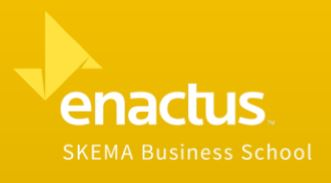
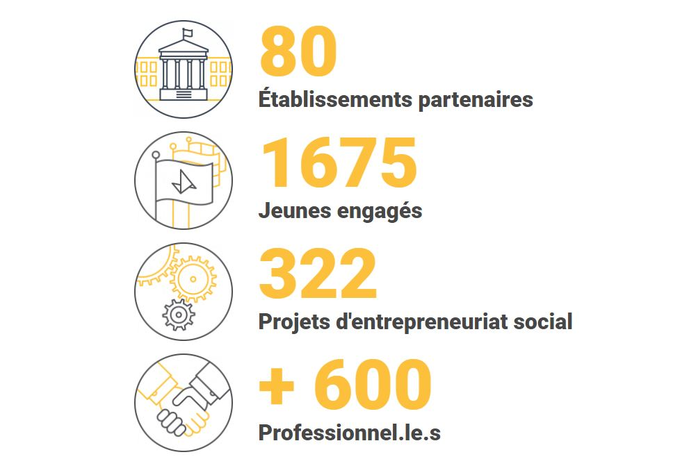
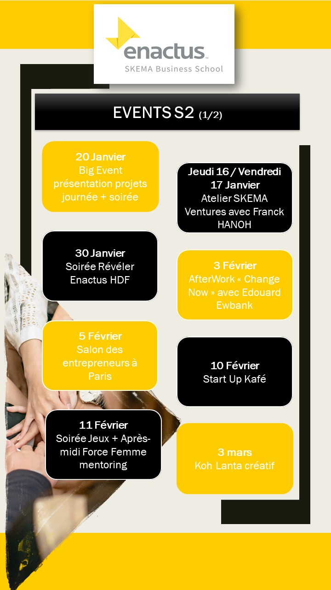
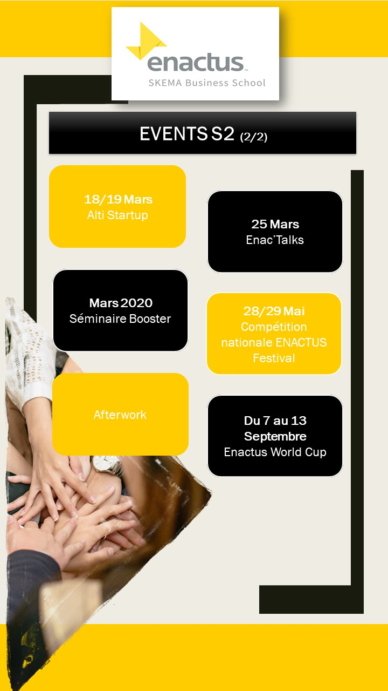
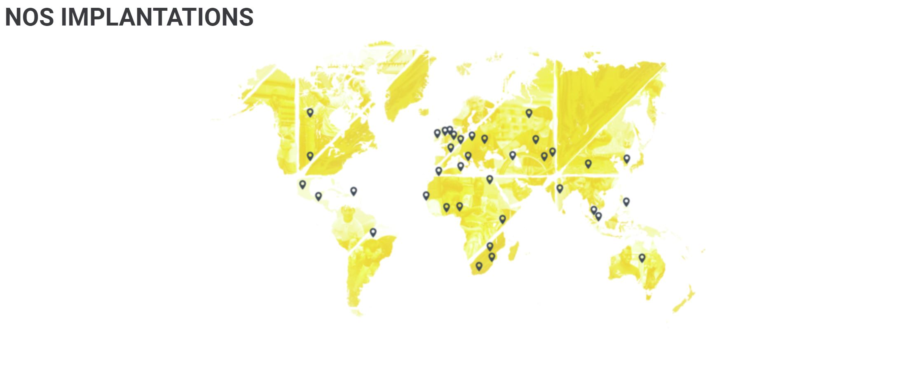

```{r setup, echo=FALSE, cache=FALSE}
library(knitr)
library(rmdformats)

## Global options
options(max.print="75")
opts_chunk$set(echo=FALSE,
	             cache=TRUE,
               prompt=FALSE,
               tidy=TRUE,
               comment=NA,
               message=FALSE,
               warning=FALSE)
opts_knit$set(width=75)
```


# ENACTUS SKEMA Lille
#WeAreEnactus

## Rejoins la plus grande organisation étudiante au Monde
### Rejoins plus de 72 000 étudiants autour de projets sur les thématiques entrepeneuriales sociales et solidaires

# ENACTUS C'est quoi ?

Enactus France est entreprise sociale hybride (association d’intérêt général et SASU) experte de la pédagogie expérientielle et de l’engagement, créée en 2002 et membre du réseau Enactus Worldwide (ONG présente dans 37 pays).

Notre métier est d’accompagner les lycéen.ne.s, les étudiant.e.s et les professionnel.le.s à développer leurs compétences pour innover et agir au service du plus grand nombre.

Nous croyons que chaque individu porte en lui le désir d’un monde plus juste, plus inclusif et plus durable et que c’est en révélant ces rêves et en donnant confiance en chacun en sa capacité à agir que nous ferons émerger une société souhaitable pour tous.

[Toute l'information sur ENACTUS France](http://enactus.fr/~)


 


## Discover who we are, what we do and why you need to join us ?

ENACTUS, c’est un réseau mondial de plus de XXX étudiants, un réseau d’étudiants volontaires et ambitieux rassemblés autour d’une seule volonté : ENTREPRENDRE et améliorer durablement le monde dans lequel nous vivons. 
Nous nous inscrivons dans un la démarche skémienne d’éveiller l’esprit entrepreneurial de ses étudiants et travaillons en étroite relation avec SKEMA Ventures par le biais de Franck HANOH et avons le suivi pédagogique de nos deux responsables d’antenne sur Lille Déborah POTELLE et Carine GARCIA
En travaillant sur des projets liés à l’économie sociale et durable, nous accompagnons sur Lille plus de 30 étudiants dans la réalisation de leurs projets de start-ups. Notre objectif : faire monter en compétences chaque étudiant en lui apportant des compétences tant théoriques que pratiques dans la gestion de projet. 
Tout au long de l’année, nous participons à des séminaires, des formations et événements organisés par ENACTUS France et ENACTUS Monde ainsi que l’antenne Hauts-de-France qui nous fournissent un support quotidien.

# Ce que nous faisons
## Echantillon des events et déplacements au S2





# NOTRE VISION
Nous croyons que chaque individu porte en lui le désir d’un monde plus juste, plus inclusif et plus durable et que c’est en révélant ces rêves et en donnant confiance en chacun en sa capacité à agir que nous ferons émerger une société souhaitable pour tous.te.s.

# NOTRE MISSION
Nous créons des expériences permettant à chacun.e de re-découvrir ses aspirations et de développer ses compétences pour innover au service du plus grand nombre.

# NOS CONVICTIONS
Chacune des actions que nous réalisons répond à 3 piliers :

Agir avec et pour les jeunes générations ⇒ Nous croyons que les jeunes générations sont naturellement porteuses de cet élan de changement et que c’est en travaillant pour et avec elles que nous accélérerons l’évolution nécessaire de l’ensemble des acteur.rice.s
Travailler en équipe autour de projets entrepreneuriaux ⇒ Nous croyons au pouvoir du collectif et à l’exigence de l’entrepreneuriat pour développer la confiance et les compétences opérationnelles, personnelles et interpersonnelles de chacun.e.
Réconcilier sens économique et utilité sociale ⇒ Nous croyons que pragmatisme économique et impact social et environnemental ne s’opposent pas et nous les réconcilions dans nos actions pour transformer durablement nos modèles.
NOS VALEURS
RESPONSABILITÉ → Nous croyons en la valeur de l’engagement personnel et en la responsabilisation de chacun.e dans ses actes. Nous agissons avec professionnalisme et exigence sur l’ensemble de nos missions.
PLAISIR → Nous croyons que c’est en travaillant avec le cœur que l’on obtient les meilleurs résultats. Nous menons nos missions avec un enthousiasme, une passion et un optimisme communicatifs !
ENGAGEMENT → Nous croyons qu’il est essentiel de  créer un monde plus juste, plus inclusif et plus durable et que c’est ensemble qu’il faut agir. Nous sommes résolument tournés vers l’action collective et mettons toute notre énergie au service du bien commun.
EMPATHIE → Nous croyons que chaque individu porte en lui une richesse inestimable qui ne demande qu’à éclore. Au quotidien, nous prenons le temps d’écouter et de valoriser chacun.e de nos accompagné.e.s avec bienveillance et attention.
TRANSMISSION → Nous croyons que c’est par le partage et la transmission que nous pourrons grandir ensemble et accélérer le changement. Nous portons une véritable expertise pédagogique et enrichissons en permanence nos connaissances au contact de nos partenaires et de nos parties-prenantes.




# L’IMPACT D’ENACTUS FRANCE
Depuis 2002, Enactus France a accompagné plus de 10 000 jeunes dans l’idéation et la conception de projets d’entrepreneuriat social.

Nous créons depuis 16 ans des programmes pédagogiques expérientiels permettant aux jeunes – étudiants et lycéens – ainsi qu’aux professionnels engagés à nos côtés de re-découvrir leurs aspirations et de développer leurs compétences pour les mettre au service d’un monde plus juste, plus inclusif et plus durable.

En 2018, nous avons réalisé une étude pour évaluer l’impact de cet engagement sur la transformation des jeunes. Nous nous sommes alliés au Cabinet (IM)PROVE, avec le soutien de la Fondation Entreprendre, pour réaliser une étude auprès de plus de 700 étudiants accompagnés ou non par nos soins.

Cette étude nous a permis de définir et d’évaluer les compétences développées par les étudiants engagés au sein du programme Enactus, tout en nous assurant de la complémentarité de nos actions par rapport aux formations proposées par les établissements de l’enseignement supérieur.

Les résultats permettront aussi aux étudiants de prendre conscience des compétences qu’ils développent et nous aideront, en tant qu’organisation, à prendre les bonnes décisions stratégiques et pédagogiques pour renforcer encore l’impact de nos actions dans les années à venir.
Enfin, les résultats de cette étude renforcent notre conviction que c’est par l’action et en conciliant vision économique et utilité sociétale que nous pourrons préparer nos jeunes et à travers eux, nous tous, à transformer nos sociétés vers des modèles plus souhaitables.


# Nos 5 projets 

## Recyc'Lille : recycler les déchêts alimentaires des marchés lillois
## LiveScene : Améliorer l'accès à la culture en proposant une offre innovante
## Cloth'Up : Upcycle du textile inutilisable pour en remplacer les objets jetables du quotidien
## Numea Project : Donner un souffle nouveau à l'artisanat africain
## Impack't Consulting : Aider les Grandes compagnies et les PME à réduire leur pollution plastique et leur production de déchêts

### Alors Rejoins l'un d'eux ;)
### On t'attends !

